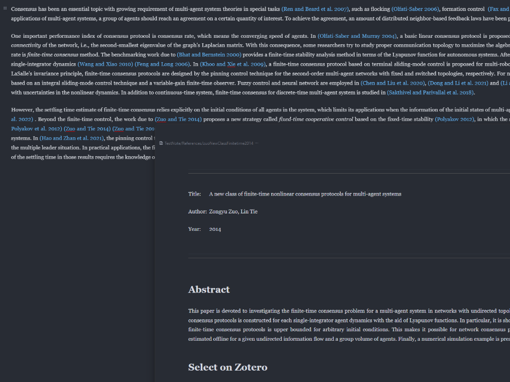

[中文 README](https://github.com/WingDr/siyuan-plugin-citation/blob/main/README_zh_CN.md)

# Citation for SiYuan

> A citation plugin that implements basic functionality, hoping to make your SiYuan more academically oriented.

**Based on the suggestion from [ttChen](https://getquicker.net/User/Actions/395924-ttChen), in the upcoming versions, the functionality of accessing Zotero using the [debug-bridge](https://github.com/retorquere/zotero-better-bibtex/releases/download/debug-bridge/debug-bridge-6.7.79.emile.limonia.xpi) plugin will be implemented. This method offers faster access speed and higher efficiency compared to the current method of using Better BibTeX. Additionally, it enables the implementation of many additional features (refer to [ttChen's Quicker action](https://getquicker.net/User/Actions/395924-ttChen) for details). Users who use Zotero/Juris-M databases should prepare in advance. For specific preparation methods, please refer to [Run Javascript in Zotero](https://www.yuque.com/chentaotao-cf9fr/gthfy4/clqahv57w5ugmdev).**

**Special thanks to [Geo123abc](https://github.com/Geo123abc) for creating the [tutorial video](https://www.bilibili.com/video/BV17u411j79z/?vd_source=b4b4ca14b1a866918dcef4ca52896f03).**

**In version 0.0.6, the template handling method has been expanded by incorporating the template engine template.js. The templates used previously can still be used in subsequent versions. If you want to use more advanced template syntax, please refer to [Advanced Template Syntax](#advanced-template-syntax).**

**In version 0.05, the indexing method of documents in the literature library has been changed from document titles to document names. After updating, the plugin will automatically update the names of unnamed literature note documents during the first startup. Please restart SiYuan afterwards to ensure that the literature notes count in the top right corner matches the number of documents in the library. When a document is created, its title will be set as the literature's citekey, and it can be changed later as desired. However, please do not change the document name in the document properties.**

**In version 0.04, a switch for "Customize Citation Link" has been added to the settings tab. If you are not an experienced user familiar with regular expression searching and SiYuan reference logic, please do not enable it.**

**In SiYuan version 2.9.4, you can use `Shift/Ctrl+Enter` to create line breaks in the "Literature Note Template" in the settings panel.**

## Features

Add citations to your notes, which refer to literature note generated in a specified folder, as shown in the following image:



## Glossary

1. **Notebook**: Refers to a notebook in the SiYuan note document tree. The library can only be placed in one of the open notebooks. If you switch to another notebook for the library, the previously selected notebook's library will become invalid.
2. **Database**: The original data source of the literature, currently supports three types: data files (BibTeX and CSL-JSON), Zotero, and Juris-M. The data files are reimported every time the software is launched, but if the files themselves change during use, you need to **"Reload the Database"** (through the settings panel or command) or **"Restart the SiYuan software"** for the changes to take effect.
3. **Library**: The location where the inserted citation links point to the literature note. It is essentially a *document located at a specific path*. Its sub-documents are all literature note that has been referenced. The content of this document itself will not be modified, but it will be updated and refreshed when citations are inserted.
4. **Literature Note**: A document generated based on the original data of the literature and the "Literature Note Template" filled in the settings panel. *The title and name of a newly created document are set as the literature's citekey.* Currently, the document is refreshed every time the corresponding literature is cited. *Please do not place personal content in the document and do not modify the document's name in the document properties. However, you can freely modify the title.*  There are plans to support user-customized area in future versions.
5. **Citation Link**: The reference link inserted in the document (or copied to the clipboard), which points to the corresponding literature note in the library. The anchor text of the link is generated based on the literature's original data and the "Citation Link Template" filled in the settings panel.

## Preparation before Use

### Configure the Plugin

1. Go to the settings panel: Click on the gear icon next to the `Citation for SiYuan` plugin switch in `Settings - Marketplace - Downloaded` to enter the settings panel. Alternatively, you can directly enter the plugin's settings panel by clicking on "Citation for SiYuan" in the plugin menu after clicking on the top toolbar's plugin button.
2. Select the [notebook](#glossary) to store the [literature note](#glossary): Only notebooks that have been opened in the document tree can be selected from the drop-down list. If the previously selected notebook is not open in the current session, the plugin will be unable to function.
3. Fill in the [library](#glossary) path: The path should start with `/`, for example, `/References` or `/Assets/References`. Note that this path is essentially the document's location, so do not include a trailing `/`. **Note: If you change the path of the library, the literature libraries on the previous path will become invalid. Additionally, please ensure that the document exists, as the plugin does not automatically create the library document if it does not exist.**
4. Select the [database](#glossary) type: Choose the type of database you want to use. If you use data files, please refer to the section [Using Data Files as the Literature Data Source](#if-you-use-bibtex-and-csl-json-files-as-the-literature-data-source). If you use Zotero or Juris-M, please refer to the section [Using Zotero or Juris-M as the Literature Data Source](#if-you-use-zotero-or-juris-m-as-the-literature-data-source).
5. Fill in the template for the title of literature content documents: Enter the template for generating titles for literature content documents. For the specific syntax of the template, please refer to [Template Syntax](#how-to-write-templates).
6. Fill in the [literature note](#glossary) template: Fill in the template for generating the literature note document's text content. Refer to the section [Template Syntax](#how-to-write-templates) for specific template syntax.
7. If you believe you are an experienced user familiar with regular expression searching and SiYuan citation logic and want to be compatible with workflows outside of SiYuan, you can choose to enable the "Customize Citation Link" switch. For the specific effect of enabling this switch, refer to the section [What Happens If I Enable the "Customize Citation Link" Switch?](#what-happens-if-i-enable-the-customize-citation-link-switch)
8. Fill in the [citation link](#glossary) template: Fill in the template for generating the anchor text of the citation link. Refer to the section [Template Syntax](#how-to-write-templates) for specific template syntax.
9. If you want to redesign your templates and data or want to see the default settings set by the plugin author, you can click the ["Delete Data"](#what-happens-when-i-click-the-delete-data-button) button to delete all the saved settings data.
10. Click "Save" to store and apply the settings.

### If You Use BibTeX and CSL-JSON Files as the Literature Data Source

- Place any number of `csl-json` and `bibtex` files in the `[Workspace]/data/storage/petal/siyuan-plugin-citation/references/` folder, which contain the literature you want to reference. Refer to [How to Obtain Literature Data Files](#how-to-obtain-bibtex-or-csl-json-files) for methods to obtain the files.
- In the plugin's settings panel, select the "BibTeX and CSL-JSON" option for the database type.

### If You Use Zotero or Juris-M as the Literature Data Source

- **Ensure that you have installed the [Better BibTex](https://github.com/retorquere/zotero-better-bibtex) plugin in Zotero or Juris-M.**
- In the plugin's settings panel, select the "Zotero" or "Juris-M" option for the database type.
- Make sure Zotero or Juris-M is open before using the plugin.

## How to Use This Plugin

## Current Features

- Slash menu:
  - Add Citation: Open the literature search panel, select a literature, and insert its [citation link](#glossary) at the cursor position, updating the library.

    You can access this option in the slash menu by typing "插入文献引用," "addcitation," or "charuwenxianyinyong."

  - Add Notes of Literature: Open the literature search panel, select a literature, and insert its note at the cursor position (this operation does not update the library). This is equivalent to copying and inserting the note from Zotero/Juris-M into the current cursor position.

    You can access this option in the slash menu by typing "插入文献笔记," "addnotesofliterature," or "charuwenxianbiji."

- Commands (can be searched and executed directly in the `Plugin Button - Command Panel` or set shortcuts in `Settings - Shortcuts - Plugin - Citation for SiYuan`):
  - Reload the Database: Reload the [database](#glossary) and reindex the [library](#glossary) based on the source of the literature. This command also updates the library.
  - Refresh all literature content document titles: Based on the current set [title template](#configure-the-plugin), refresh the titles of all literature content documents in the [literature library](#glossary).
  - Copy Citation: Open the literature search panel, select a literature, and copy its [citation link](#glossary) to the clipboard, updating the library.
- Title block icon menu:
  - Refresh Citations: Refresh the anchor text of all [citation links](#glossary) in the current document using the current [citation link template](#configure-the-plugin). When the citation link template changes, you can use this feature to refresh the formatting of all citation links in the document.


## Template Syntax

- The template text syntax uses Markdown syntax.
- Parts to be replaced by variables are wrapped in `{{ }}`, for example, `{{title}}`.
- In the [literature note template](#configure-the-plugin) input box, you can use `Shift/Ctrl + Enter` for line breaks and use `Tab` for indentation.

The following variables can be used in the literature note and citation templates:

```markdown
- {{citekey}}: The unique identifier of the literature. It is recommended to generate it using the Better BibTeX plugin for Zotero.
- {{abstract}}: The abstract of the literature.
- {{authorString}}: The string containing all authors listed in order.
- {{containerTitle}}: The title of the container (journal, conference proceedings, etc.) where the literature is located.
- {{DOI}}: The DOI of the literature.
- {{eprint}}: The eprint of the literature.
- {{eprinttype}}: The eprint type of the literature.
- {{eventPlace}}: The place of the event (conference, etc.).
- {{page}}: The page number of the literature.
- {{publisher}}: The publisher of the literature.
- {{publisherPlace}}: The location of the publisher.
- {{tags}}: A the tags connected with ", " (It is not exist in CSL-JSON file)
- {{title}}: The title of the literature.
- {{titleShort}}: The abbreviated title of the literature. Many literature do not have abbreviated titles.
- {{type}}: The type of literature. (It might be different between accessed through Zotero directly and the exported BibTex and CSL-JSON files)
- {{URL}}: The URL of the literature.
- {{year}}: The publication year of the literature.
- {{files}}: The attachments of the literature.
- {{zoteroSelectURI}}: Direct link to the corresponding entry in Zotero.
- {{note}}: Notes made in Zotero, with support for direct links to Zotero.
```

In addition, the following variables can be used in citation links:

```markdown
- {{shortAuthor}}: Generates a shorter author string according to the IEEE format, e.g., `Lin and Morse et al.`
- {{citeFileID}}: The ID of the literature note document within SiYuan, used to assist in generating citation links or external links, e.g., `20230707192208-ocs4482`
```

### Advanced Template Syntax

In version 0.0.6, the template handling section utilizes [template.js](https://github.com/yanhaijing/template.js). To adapt to the template syntax commonly used by users, all `{{ }}` will be replaced with `<%= %>` before variable calculations and replacements, allowing template.js to process the templates. Therefore, in addition to using the old `{{variable}}` syntax, there are also many advanced usage methods available:

1. Wrap JavaScript statements within `{{ }}`.
2. Use the native syntax of template.js (you can refer to the [EJS syntax](https://ejs.bootcss.com/#docs)).

For example, the following template allows the line to not appear as "**Tags**: " when there are no `{{tags}}` variables:

```JavaScript
{{ tags.length ? `\n**Tags**:\t\t${tags}` : "" }}
```

And the following template prevents the "Files" section from being generated when there are no associated files:

```JavaScript
<% if (files.length) { %>
# Files

<%= {{files}} %>
<% } %>
```

**Note:** All variables return strings and will not directly return `null`. Please use `.length` to check if a variable exists.

## How to Obtain BibTeX or CSL-JSON Files

- If you use Zotero:
  
  Use the Better BibTeX plugin to export your library in the format of Better BibLaTex or Better CSL JSON (select "Keep Update" to apply changes made to Zotero entries in SiYuan in real-time).

- If you use other reference management software:
  
  The `sample.bib` and `sample.json` files in `[Workspace]/data/siyuan-plugin-citation/sample-data/` are provided for reference. If your software can provide exports in these formats, you can use them.

  ***Note: In the .bib and .json files, each literature's citekey/id must be unique.***

## What Happens If I Enable the "Customize Citation Link" Switch?

The [citation link template](#configure-the-plugin) will be fully customized, meaning that the template will no longer generate anchor text, but will be **directly inserted into the document**. In this case, to avoid affecting your own content, the refresh citation feature of the plugin will **not maintain the non-link parts (outside the double brackets)**.

**The regular expression for finding citation links is /\\(\\((.\*?)\\\"(.\*?)\\\"\\)\\)/g. Please make sure your template format conforms to this expression.**

⚠️**Note: After enabling the switch, please make sure your template includes `...(( {{citeFileID}} "..."))...`, otherwise the generated links will not be able to reference the literature note.**

## What Happens When I Click the "Delete Data" Button?

Clicking the "Delete Data" button will delete all the data saved in the settings panel and restore it to the initial values set by the plugin author.

**Note**: This feature **does not** delete the .bib and .json files!

## Common Error Types

### Please Select Notebook in Setting Tab

Please check if the [notebook](#configure-the-plugin) option in the settings panel is blank. The library must be located in an open notebook, otherwise, the plugin will not work. If the notebook where the library is located is closed, you need to reselect the notebook and path for the library.

### Library Directory Does Not Exist

Please check if the [library](#glossary) document exists. To prevent users from unintentionally disrupting their document hierarchy, the plugin does not automatically create a document in the document tree. When the library document does not exist, the plugin's functionality cannot be used.

After creating the document, you need to [reload the database](#current-features). Although it is not necessary, it is **highly recommended restarting the SiYuan** to ensure the effectiveness of setting.

### Zotero/Juris-M Is Not Running

Please check the status of your Zotero/Juris-M and ensure that you have installed the [Better BibTeX](https://github.com/retorquere/zotero-better-bibtex) plugin in Zotero/Juris-M. This plugin relies on the Better BibTeX plugin to run. There are plans to directly access zotero.sqlite without relying on this plugin in the future.

### All These Problems Are Not Included

It is welcomed to raise an [issue](https://github.com/WingDr/siyuan-plugin-citation/issues)

## TODO

- [x] Integration with Zotero (Long-term)
- [ ] Support user-customized area in literature note (Probably in the next version)
- [ ] Support copying markdown text with citations (Probably in the next version)
- [ ] Support direct access to zotero.sqlite, refer to [obsidian-zotero](https://github.com/PKM-er/obsidian-zotero) (Long-term and difficult)
- [ ] Export support for Word (Long-term)
- [ ] Export support for LaTeX (Long-term)
- [ ] Support citation of formulas and automatic numbering (Long-term)
- [ ] Support adding LaTeX definition blocks such as Remark, Lemma (Long-term)
- [ ] UI beautification (Mind-boggling)
- [ ] Function optimization:
  - [ ] More lenient template/path format restrictions (Please provide more feedback through issue reports)
  - [ ] Better template handling (Difficult to implement)
  - [ ] Remove invalid functions from the command panel (Waiting for updates from the SiYuan team)
  - [ ] Support using indexes in citation links (Waiting for updates from the SiYuan team)
  - [ ] Adaptation for mobile devices (Anyone willing to test?)

## Acknowledgments

The code of the following projects was referenced, and I would like to express my gratitude:

[sy-transfer-refs](https://github.com/frostime/sy-transfer-refs)

[obsidian-citation-plugin](https://github.com/hans/obsidian-citation-plugin)

[siyuan-plugin-importer](https://github.com/terwer/siyuan-plugin-importer)

[obsidian-zotero-integration](https://github.com/mgmeyers/obsidian-zotero-integration)

[template.js](https://github.com/yanhaijing/template.js)

Thanks to everyone in the "思源笔记折腾群" for answering my questions and providing guidance. 

Thanks to [Geo123abc](https://github.com/Geo123abc) for providing information, suggestions, and testing support.

## Sponsorship

> I'll just put a QR code here for donations, but feel free to use it for free. Providing feedback and seeing more people using it is the greatest encouragement for me.


