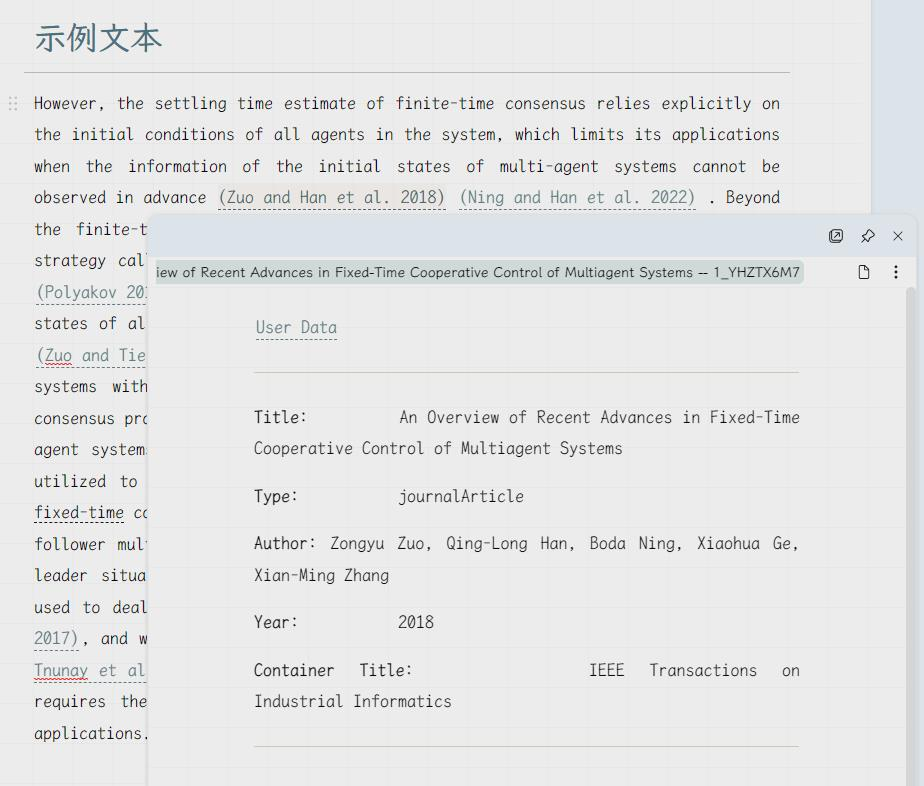
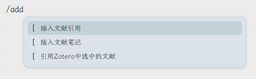
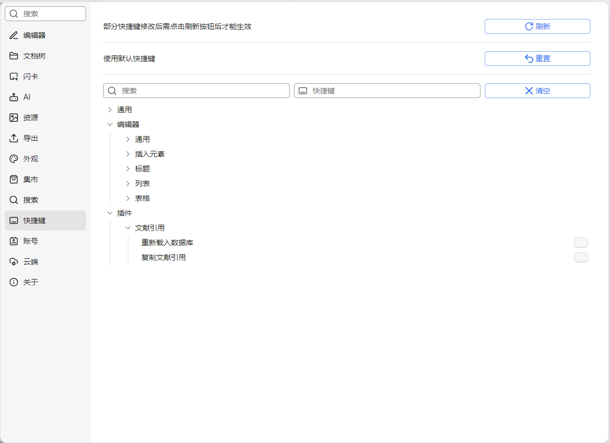
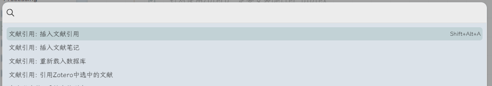
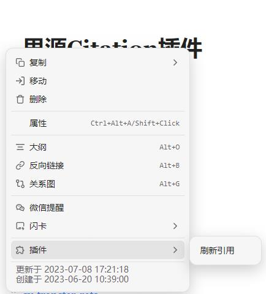
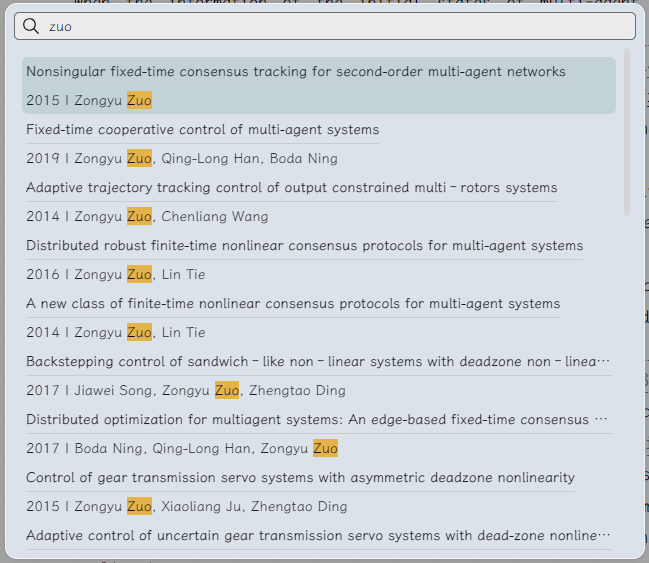
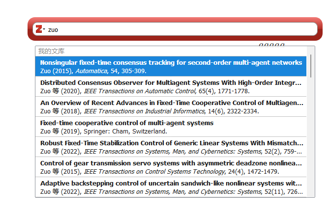
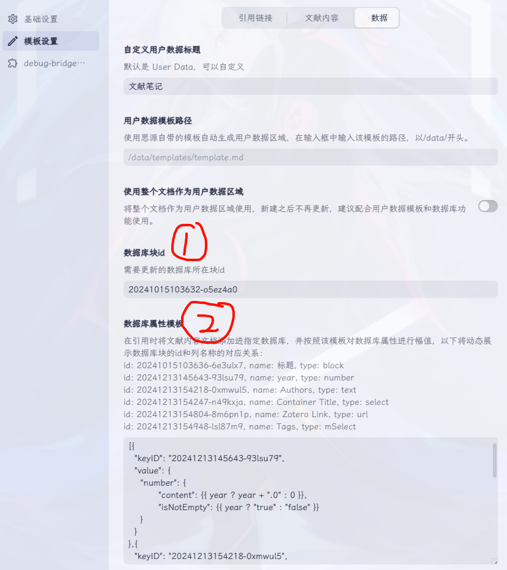

[README English](https://github.com/WingDr/siyuan-plugin-citation/blob/main/README.md)

# Citation for SiYuan

> 已经实现了基本功能的引用插件，从这里开始将思源变得更加学术

**0.4.0重要更新**
1. **修改了引用逻辑，相邻的引用应当一同编辑**
2. **支持设定多种引用格式**
3. **支持最新的debug-bridge-1.0，修改了通信细节（兼容旧版）**
4. **支持导出带有zotero引用的word文档和LaTex**
5. **支持数据库同步（但是模板比较难写，需要对思源的数据库有一定认知）**

**感谢[Geo123abc](https://github.com/Geo123abc)制作的[教学视频](https://www.bilibili.com/video/BV17u411j79z/?vd_source=b4b4ca14b1a866918dcef4ca52896f03)**

## 功能

在笔记中添加文献引用，该引用指向在你指定的文件夹下生成的文献内容，如下图所示：



## 名词说明

1. **笔记本**：即思源笔记文档树中的笔记本，文献库只能放置在其中一个已经打开的笔记本中，如果切换文献库所在笔记本那么原本笔记本中的文献库将失效。
2. **数据库**：文献的原始数据来源，目前支持数据文件（BibTex和CSL-JSON）、Zotero/Juris-M（使用better-bibtex插件）和Zotero/Juris-M（使用debug-bridge插件）三种数据来源。其中数据文件在每次启动软件时都会重新导入，但是如果在使用中文件本身产生变化，需要【重新载入数据库】（通过设置面板或命令）或者【重启思源软件】才能生效。
3. **文献库**：存放已经插入引用连接的文献内容的位置，本质上是一个*处于特定路径的文档*，它的子文档为所有引用过的文献内容，该文档本身的内容不会被修改，但是在插入引用时会增添和刷新它的子文档。
4. **文献内容**：根据文献的原始数据和设置界面填写的“*文献内容模板*”生成的文档，*新建文档的标题和命名为该文献的citekey或者itemKey*。目前该文档的内容在每次引用对应文献时都会刷新，因此 **请不要在文档属性修改自定义属性literature-key**，目前文献内容已经支持用户数据区域，详见[文献内容详解](#文献内容详解)，**非用户数据区域请不要填入个人内容**。
5. **引用链接**：在文档中插入（也可以选择直接复制到剪贴板）的引用链接，该链接指向文献库中对应的文献内容，其锚文本为通过文献原始数据和设置界面填写的“*引用模板*”生成的文本。

## 使用前准备

### 决定选择哪种数据来源

目前可以使用的文献数据来源包括数据文件（BibTex和CSL-JSON）、Zotero/Juris-M（使用better-bibtex插件）和Zotero/Juris-M（使debug-bridge插件）三种，下表给出了三种数据来源之间的对比：

| 数据来源 | BibTex和CSL-JSON | Zotero/Juris-M<br>使用better-bibtex插件 | Zotero/Juris-M<br>使用debug-bridge插件 |
|:----|:----:|:----:|:----:|
| 文献标识 | <b>citekey</b><br>允许多个文件<br>自行保证唯一性 | <b>citekey</b><br>由BBT生成 | <b>citekey / itemKey</b><br>citekey由BBT生成<br>itemKey由Zotero生成 |
| 搜索面板 | Citation插件面板 | Zotero面板 | Citation插件面板 / Zotero面板 （可选） |
| 初始化速度 | 慢 | 快 | 快 |
| 搜索/插入速度 | 快 | 慢 | 快（Citation插件面板） |
| 兼容Zotero 7 | - | √ | √ |
| 兼容其它文献管理软件 | ✓ | × | × |
| 支持导入pdf标注<br>（annotations） | × | × | ✓ |
| 支持从Zotero拖入选中/批注时自动引用 | × | ✓ | ✓ |
| 支持通过搜索面板<br>一次性插入多篇文献 | × | ✓ | ×（Citation插件面板）<br>✓ （Zotero面板） |
| 同时修改相邻的多个引用 | × | × | ✓ |
| 插入在Zotero中<br>选中的条目 | × | × | ✓ |
| 支持在Zotero条目中<br>插入跳转思源链接 | × | × | ✓ |
| 支持在Zotero条目中<br>插入自定义标签 | × | × | ✓ |
| 导出带有引用的word文档 | × | × | ✓ |
| 导出带引用的LaTex | × | × | ✓（同时要求安装better-bibtex插件） |

### 对插件进行基本设置
1. 进入设置界面：点击`设置-集市-已下载-文献引用`插件开关旁边的齿轮按钮进入设置界面，也可以通过在顶栏插件按钮点击后的菜单中点击`文献引用`直接进入插件的设置界面。
2. 选择存放[文献内容](#名词说明)的[笔记本](#名词说明)：只能下拉选择已经在文档树中打开的笔记本，如果之前设置的笔记本本次启动未打开，那么将无法使用本插件。
3. 填写[文献库](#名词说明)路径：路径以`/`开头，例如`/References`或者`/Assets/References`，注意该路径本质上为文档所在路径，不要在最后加`/`。**注意：如果更换了文献库的路径，之前路径上的文献库将失效。此外，请确保该文档存在，因为[本插件不会自动创建文献库文档](#文献库路径不存在)**
4. 选择[数据库](#名词说明)类型：选择使用的数据库的类型，如果使用数据文件请参考[使用数据文件作为文献数据来源](#如果你使用bibtex和csl-json文件作为文献数据的来源)，如果使用Zotero/Juris-M（使用better-bibtex插件）请参考[使用Zotero/Juris-M（使用better-bibtex插件）作为文献数据来源](#如果你使用-zoterojuris-m-better-bibtex-作为文献数据来源)，如果使用Zotero/Juris-M（使用better-bibtex插件）请参考[使用Zotero/Juris-M（使用debug-bridge插件）作为文献数据来源](#如果你使用-zoterojuris-m-debug-bridge-作为文献数据来源)。
5. 如果你选择Zotero/Juris-M（使debug-bridge插件）作为文献数据来源，推荐开启“使用itemKey作为索引”选项
6. 填写[文献内容文档标题]模板：填写生成文献内容文档的标题模板，模板的具体写法参考[模板写法](#怎么写模板)。
7. 填写[文献内容](#名词说明)模板：填写生成文献内容文档的文本内容模板，模板的具体写法参考[模板写法](#怎么写模板)。
8. 如果你认为你是对正则表达式查找和思源引用逻辑有了解的资深用户，并且想要兼容思源外的工作流，可以选择打开`自定义引用`的开关，打开该开关的具体效果详见[如果我打开了“自定义引用”的开关]()
9. 填写[引用链接](#名词说明)模板：填写生成引用链接锚文本的模板，模板的具体写法参考[模板写法](#怎么写模板)。
10. 如果你希望重新设计你的模板和数据，或者希望看到插件作者设置的默认设置，可以通过[删除数据](#点击“删除数据”后会发生什么)按钮将保存的设置数据全部删除。
11. 选择是否使用动态锚文本的引用链接（如果还打开了“自定义引用”的开关，则还需要输入文档命名模板，以便在插入时自定义文献内容文档的命名），详细参考[引用链接该使用静态锚文本还是动态锚文本](#引用链接该使用静态锚文本还是动态锚文本)
12. 关闭设置面板后设置信息会自动保存。
13. 重启思源笔记（如果是在托盘区，也要完全退出来），重启之后如果设置没有生效，或者更新插件之后版本不对，请再次重启一至两次，有可能可以解决，但是目前不排除还有bug。

**如果对这个过程仍然有疑惑，请参考[Geo123abc](https://github.com/Geo123abc)制作的[教学视频](https://www.bilibili.com/video/BV17u411j79z/?vd_source=b4b4ca14b1a866918dcef4ca52896f03)。如果仍然无法解答您的疑惑，欢迎到本插件的github仓库上提[issue](https://github.com/WingDr/siyuan-plugin-citation/issues)或者将问题发送到我的邮箱(siyuan_citation@126.com)**

### 如果你使用BibTex和CSL-JSON文件作为文献数据来源

- 在`[工作空间]/data/storage/petal/siyuan-plugin-citation/references/`文件夹下，放置任意数量的`csl-json`和`bibtex`文件，其中包含你所想要引用的文献，文件的获取方法参考[如何获得文献数据文件](#如何获得bibtex或者csl-json文件)。
- 在插件的设置面板中，数据库类型处选择`BibTex and CSL-JSON`。

### 如果你使用 Zotero/Juris-M (better-bibtex) 作为文献数据来源

- **确保你的 Zotero 或者 Juris-M 中安装了 [Better BibTex](https://github.com/retorquere/zotero-better-bibtex) 插件。**
- 在插件的设置面板中，数据库类型处选择`Zotero (better-bibtex)`或者`Juris-M (better-bibtex)`。
- 在使用前确保你的 Zotero 或者 Juris-M 是打开的。

### 如果你使用 Zotero/Juris-M (debug-bridge) 作为文献数据来源

- **确保你的 Zotero 或者 Juris-M 中安装了 [debug-bridge](https://github.com/retorquere/zotero-better-bibtex/releases?q=debug-bridge&expanded=true) 插件，并按照 [Run Javascript in Zotero](https://www.yuque.com/chentaotao-cf9fr/gthfy4/clqahv57w5ugmdev) 教程进行配置（可以不选择“CTT”作为密码，只需要在设置面板中进行相应设置）**
- 仍然推荐在Zotero中安装Better BibTex插件，以自动生成条目的citekey属性。
- 在插件的设置面板中，数据库类型处选择`Zotero (debug-bridge)`或者`Juris-M (debug-bridge)`。
- 在设置面板的“debug-bridge插件”栏中，输入设置时配置的密码，并选择使用SiYuan（Citation插件面板）或者Zotero面板作为搜索面板。
- 在使用前确保你的 Zotero 或者 Juris-M 是打开的。


## 目前有什么功能

- 斜杠菜单：
  - 插入文献引用：弹出文献搜索面板，选中文献后在光标位置插入该文献的[引用链接](#名词说明)，并更新文献库。

    通过输入“插入文献引用”、“addcitation”、“charuwenxianyinyong”都可以在斜杠菜单中索引到这个选项

  - 插入文献笔记：弹出文献搜索面板，选中文献后在光标位置插入该文献的笔记（该操作不更新文献库）。【相当于将Zotero/Juris-M中的笔记复制并插入到当前光标位置】

    通过输入“插入文献笔记”、“addliteraturenotes”、“charuwenxianbiji”都可以在斜杠菜单中索引到这个选项

  - 引用Zotero中选中的文献（仅debug-bridge插件可用）：在Zotero中选中文献后，运行该命令则可直接将选中的（多个）文献插入到当前光标位置。
    
    通过输入"引用Zotero中选中的条目"、"addzoteroselecteditemscitations"、"yinyongzoterozhongxuanzhongdetiaomu"都可以在斜杠菜单中索引到这个选项。

- 命令（可以在`顶栏插件按钮-命令面板`直接搜索选中，或者在`设置-快捷键-插件-文献引用`中设置快捷键使用）：
  - 重新载入数据库：重新根据文献的来源载入[数据库](#名词说明)，同时也会重新索引[文献库](#名词说明)。
  - 插入文献引用：弹出文献搜索面板，选中文献后将该文献的[引用链接](#名词说明)插入到当前光标位置，并更新文献库，如果非快捷键调用或者光标没有聚焦在编辑器，则改为复制到剪贴板。
  - 插入文献笔记：弹出文献搜索面板，选中文献后将该文献的笔记插入到当前光标位置，如果非快捷键调用或者光标没有聚焦在编辑器，则改为复制到剪贴板。
  - 引用Zotero中选中的文献：同斜杠菜单功能，如果非快捷键调用或者光标没有聚焦在编辑器，则改为复制到剪贴板。
  - 刷新所有文献内容：对文献库中的所有文献内容进行刷新，建议多等待一段时间再进行下一步操作
- 文档标题块菜单：
  - 刷新引用：使用当前的[引用链接模板](#对插件进行设置)刷新当前文档的全部（**在当前设置的[文献库](#名词说明)中有存放[文献内容](#名词说明)**）的引用链接的锚文本。当引用链接模板有变化时，可以通过该功能刷新文档内全部的引用链接格式。
  - 刷新文献内容（仅当该文档在文献库中并且被载入）：刷新当前文档的文献内容，相当于再引用一次该文献但是不复制引用链接
  - 导出：支持将带引用的文档导出为带zotero引用的Markdown、Word以及LaTex文件，其中导出Word不要求Zotero中安装better-bibtex插件，而导出带citekey引用的Markdown文件以及LaTex文件都要求Zotero中按章better-bibtex插件。
- 引用链接右键菜单：
  - 切换引用格式：将选中的引用（包含相邻的多个引用）转换为指定的引用格式。













## 怎么写模板

- 模板文本语法使用的是 Markdown 语法。

- 想要被变量替换的部分用`{{ }}`包裹，例如`{{title}}`。

- 在[文献内容模板](#对插件进行设置)输入框中可以使用`Shift/Ctrl + Enter`换行，和用`Tab`输入制表符。

在文献内容和引用的模板中可以使用如下变量，默认不存在时为`undefined`：

```markdown
- {{key}}：文献的唯一标识，根据“使用itemKey作为索引”选项开启的不同为“libraryID_citekey”，或者“libraryID_itemKey”，必定存在。
- {{citekey}}：文献的标识，使用数据文件需要自行保证唯一性，使用better bibtex插件会自动生成，如果没有安装bbt插件则与itemKey相同
- {{itemKey}}：文献条目在Zotero中的唯一标识，由Zotero自动生成，不使用Zotero则不存在
- {{libraryID}}：文献内容在Zotero中的库ID，如果使用数据文件则默认为1，未来将据此支持多个库（多个文件可重复citekey）的搜索插入，不使用Zotero则不存在
- {{abstract}}：摘要
- {{authorString}}：所有作者按顺序排列的字符串，不存在则为空字符串
- {{creators}}: 作者列表，为初始数据源格式，方便用户自定义。本身是一个对象列表，可以通过`.`调用其属性，不存在则为空列表。
- {{firstCreator}}: 第一个作者
- {{containerTitle}}：文献所在刊物（论文集、期刊等）标题，不存在则为null
- {{DOI}}：文献的 DOI
- {{eprint}}：预印本
- {{eprinttype}}：预印本类型
- {{eventPlace}}：（会议等）地点
- {{page}}：页码
- {{publisher}}：出版商
- {{publisherPlace}}：出版商所在地
- {{tags}}: 所有的标签，以", "连接， CSL-JSON 文件中没有此变量，不存在则为空字符串
- {{title}}：标题
- {{titleShort}}：简写标题，很多文献不存在简写标题
- {{type}}：文献的类型（注意：直接从 zotero 获取的和导出后再获取的文献类型标识可能不一样）
- {{URL}}：文献的访问网址
- {{year}}：文献的发表年份
- {{files}}：文献的附件。会直接显示默认样式，每行一个文件，并附带跳转到 zotero 的链接（如果是 pdf 则链接可以直接在 zotero 中打开 pdf 。
- {{fileList}}：文献的附件，为初始数据源格式，方便用户自定义。本身是一个对象列表，可以通过`.`调用其属性，不存在则为空列表。具体属性的调用方法如下：
  - {{fileList[i].type}}：附件的类型，即文件扩展名
  - {{fileList[i].fileName}}：附件的完整文件名
  - {{fileList[i].path}}：附件的绝对路径，带有`file://`
  - {{fileList[i].zoteroSelectURI}}：在 Zotero 中能够选中附件的链接（仅链接）
  - {{fileList[i].zoteroOpenURI}}：在 Zotero 中能够直接打开附件的链接（仅链接，仅pdf文件）
- {{zoteroSelectURI}}：可以直接跳转到Zotero对应的条目
- {{note}}：在Zotero中做的笔记，其中的链接支持直接跳转到Zotero
```

此外，在引用链接中还可以使用下面的变量：

```markdown
- {{shortAuthor}}：按照IEEE格式（大概）生成较短的作者字符串，例如`Lin and Morse et al.`，不存在则为空字符串
- {{citeFileID}}：文献内容文档在思源内部的ID，用于辅助生成引用链接或者外链，例如 `20230707192208-ocs4482`
```

模板中还包含以下特殊变量：

- {{getNow}}：当前时间的`moment()`对象，可以在模板中自定义格式，方法参考[moment.js](https://momentjs.com/)。

如果你使用 Zotero/Juris-M (debug-bridge) 作为文献数据来源，则可使用下面的变量：

```markdown
- {{annotations}}：文献的pdf标注，将按所属的文档区分，同样支持批注的展示，不存在则为空字符串。
- {{annotationList}}：pdf批注的初始数据源格式，方便用户自定义。本身是一个对象列表，可以通过`.`调用其属性，不存在则为空列表。具体属性的调用方法如下：
  - {{annotationList[i].parentKey}}：标注所在pdf条目的itemKey
  - {{annotationList[i].parentTitle}}：标注所在pdf文件的标题
  - {{annotationList[i].detail}}：单个pdf文件标注的细节，是一个列表
    - {{annotationList[i].detail[j].key}}：单个标注的itemKey
    - {{annotationList[i].detail[j].annotationText}}：单个标注的文本内容
    - {{annotationList[i].detail[j].annotationComment}}：单个标注的批注
    - {{annotationList[i].detail[j].annotationPosition}}：单个标注的位置，可以用`.pageIndex`获得标注的页码
    - {{annotationList[i].detail[j].zoteroOpenURI}}：直接在Zotero中打开标注位置的链接
```

更多的变量可以在导入文献后查看文献内容文档的“entry-data”属性，其中包含了导入的所有该文献信息。

### 模板的高级写法

在0.0.6版本中，模板处理部分使用了[template.js](https://github.com/yanhaijing/template.js)，为了适配一般用户的模板语法，在进行变量计算和替换之前，会将所有的`{{ }}`替换为`<%= %>`以供 template.js 进行模板处理。因此，除了使用旧有的`{{变量}}`语法外，还可以有很多高级的使用方法：

1. 在`{{ }}`中包裹`JavaScript`语句
2. 使用 template.js 原生语法（可以参考 [EJS 语法](https://ejs.bootcss.com/#docs)）

例如如下模板，就可以在条目没有变量`{{tags}}`时让本行不出现`**Tags**:`：

```JavaScript
{{ tags.length ? `\n**Tags**:\t\t${tags}` : "" }}
```

而如下模板能够让 Files 这一栏在没有附属的文件时不在生成：

```JavaScript
<% if (files.length) { %>
# Files

{{files}}
<% } %>
```

这一段模板和下面这一段模板有同样效果：

```Javascript
<% if (fileList.length) { %>
# Files

{{fileList.map(file => {if (file.type === "pdf") return `[[Open]](${file.zoteroOpenURI})\t|\t[${file.fileName}](file.path)`; else return `[[Locate]](${file.zoteroSelectURI})\t|\t[${file.fileName}](file.path)`;}).join("\n")}}
<% } %>
```

**注意：**所有变量返回的都是字符串，而不会直接返回`null`，所以请根据`.length`判断变量是否存在。

## 文献内容详解

在v0.0.8版本中，文献内容支持了用户数据区域，其标志是默认名为`User Data`的一级标题（以便思源的悬浮预览能够直接预览到所有的用户数据），在这个标题之后的部分不会随着引用更新，但是由此也对文献内容的格式产生了一些要求。现在单个文献的文献内容文档格式如下：

```markdown
[用户数据标题](siyuan://blocks/用户数据标题块ID)

模板生成内容

# 用户数据标题（默认为“User Data”）

用户数据内容
```

在0.4.0版本中，增加了将全部文献内容文档设定为用户数据区域的开关，开启则不会有用户数据标题以及模板生成的内容，即全文档可自行修改。

### 可以修改什么

- 全部在`# 用户数据标题`下方（包括该标题的内容）都是可以进行修改的，不会随着文献引用而更新。
- 文档开头的引用可以添加锚文本，但是此时它将不会随用户数据标题变化（转变为静态锚文本）。

### 不能修改什么

- 在`# 用户数据标题`上方的部分，是会随着文献引用而更新的（包括最上方的引用），因此请不要修改。
- **不要删除`# 用户数据标题`这个标题本身！！** 如果仅仅是清空其内容，块ID是不会变化的，但是如果将这个标题删除之后再新建，块ID会产生变化，进而在下次引用中会清空所有下方的用户数据！！！
- **不要删除文档开头的引用！** 如果删除该引用，插件将找不到用户数据区域，此时全部内容将刷新。

### 如果已经删除了引用/标题，该如何修复

- 在想要保留的数据的最上方加入标题。
- `右键标题-复制-复制为引用块`，粘贴在文档的第一行。
- **确保文档第一行中只有该引用链接**

## 如何获得`BibTex`或者`CSL-JSON`文件

- 如果你使用`Zotero`：
  
  使用`Better BibLatex` 插件，以`Better BibLaTex`或者`Better CSL JSON`的格式导出文献库（同时可以选择`Keep Update`以便在修改Zotero中的条目后能够及时应用在思源中）

- 如果你使用的其它文献管理软件：
  
  在`[工作空间]/data/siyuan-plugin-citation/sample-data/`中提供了`sample.bib` 和 `sample.json` 用于参考，如果你使用的软件能够提供这样的导出，那么就可以使用

  ***注意！在`.bib`和`.json`文件中，每个文献的`citekey/id`必须是唯一的***

## 网页/docker版使用前提

在0.3.6版本后，通过在浏览器上安装[CORS Unblock 插件](https://webextension.org/listing/access-control.html)可以使用浏览器前端与zotero通信。

## 打开“自定义引用”的开关后会发生什么

[引用链接模板](#对插件进行设置)将变为完全自定义引用的格式，即引用链接模板生成的内容不再为锚文本，而是将**直接插入文档**。此时，为了避免对用户自身内容的影响，插件的刷新引用功能将**不会对链接（即双括号）外的部分进行维护**。

**查找引用链接的正则表达式为 /\\(\\((.\*?)\\\"(.\*?)\\\"\\)\\)/g ，请据此把握好您的模板格式**

⚠️**注意：开关开启后请确保你的模板中包含`...(({{citeFileID}} "..."))...`否则生成的链接将无法引用**

## 引用链接该使用静态锚文本还是动态锚文本

本插件强烈建议用户使用静态锚文本的引用链接（即链接中包裹锚文本的是双引号，并且锚文本不随被引用文档的命名更新而更新），不仅是因为静态锚文本相对来说更加稳定，而且在此后的功能追加中，可能会给引用链接添加参数，即可以区分该链接的格式（类似于LATEX中的\citep和\citet）。

如果使用动态锚文本的引用链接，引用后会暂时显示文献内容的文档id，使用`F5`刷新之后才会显示文档。

## 点击“删除数据”后会发生什么

“删除数据”按钮会将设置界面填写保存的所有数据都删除，并将其**还原为插件作者所设置的初始值**。

**注意**：该功能**不会**导致`.bib`和`.json`文件被删除！

## 使用数据库统计文献信息

从0.4.0版本开始，文献引用插件支持在引用的同时更新数据库，并按一定模板规则更新数据库数据。如果要开启该功能，需要在设置面板中进行一定的配置。
1. 在`数据库块id`中填入想要更新的数据库所在块的id。
2. 此时`数据库属性模板`的说明中将会显示如下的数据库列详细信息，然后以json格式填写数据库属性模板。注意这里根据模板生成的json格式数据会直接作为`/api/av/setAttributeViewBlockAttr`这个api的传入参数，所以数据库没有更新可能是因为json内部一些数据的格式错误导致的。



## 扩展：从zotero反过来索引到思源中的文献内容文档

**注意：该功能仅适用于使用debug-bridge插件的模式中，因为传输的数据是itemKey，其他模式获取不到**

参考[这个论坛中的方法](https://forums.zotero.org/discussion/37129/adding-search-engines)，在`engine.json`中添加下面这项：
```json
{
  "_name": "SiYuan",
  "_alias": "SiYuan",
  "_description": "Open Ref in SiYuan",
  "_icon": "https://b3log.org/siyuan/favicon.ico",
  "_hidden": false,
  "_urlTemplate": "siyuan://plugins/siyuan-plugin-citation/open-ref?key={z:key}",
  "_urlParams": [],
  "_urlNamespaces": {
    "z": "http://www.zotero.org/namespaces/openSearch#",
    "": "http://a9.com/-/spec/opensearch/1.1/"
  },
  "_iconSourceURI": "https://b3log.org/siyuan/favicon.ico"
}
```

## 常见错误类型

### 未选择笔记本

请检查设置面板中[笔记本](#对插件进行设置)选项是否为空白。文献库必须位于已经打开的笔记本中，否则本插件将无法使用。如果文献库所在的笔记本被关闭，则需要重新设定文献库所在笔记本和路径。

### 文献库路径不存在

请检查[文献库](#名词说明)文档是否存在。由于不希望用户在无意间打乱自身的文档层级安排，因此本插件不会自动在文档树中新建文档，当文献库文档不存在时，将无法使用本插件的功能。

新建相关文档之后，需要[重新载入数据库](#目前有什么功能)。虽然理论上没有必要，但是**强烈建议重新启动思源笔记**，以保证文献库路径生效

### Zotero/Juris-M 没有在运行

请检查您的 Zotero/Juris-M 的打开状态，以及在 Zotero/Juris-M 中是否安装了 [Better BibTex](https://github.com/retorquere/zotero-better-bibtex) 插件，本插件依赖于该插件运行，目前有不依赖该插件[直接访问zotero.sqlite](#todo)的计划。

### 这些问题都不是

欢迎到本插件的github仓库上提[issue](https://github.com/WingDr/siyuan-plugin-citation/issues)或者将问题发送到我的邮箱(siyuan_citation@126.com)

## TODO

- [ ] 支持添加 Remark, Lemma 等 LATEX 定义块
- [ ] 支公式引用
- [ ] 适配移动端

## 开发者

本插件对外暴露特定的Event以供外部调用。调用方法如下：

1. 获取`window.siyuan.ws.app.plugins`下本插件的`eventBus`对象
  
  `window.siyuan.ws.app.plugins.find(p => p.name === "siyuan-plugin-citation").eventBus`
2. 使用`eventBus.emit(rule: TRuleType, e: CustomEventDetail)`来发送请求

```typescript
  type TRuleType = "GetFromPool" | "Refresh";
  interface RefreshEventDetail extends CustomEventDetail {
    type: "database" | "literature note";
    docIDs?: string[];
    keys?: string[];
    refreshAll?: boolean;
    confirmUserData?:boolean;
  }

  interface GetEventDetail extends CustomEventDetail {
    keyorid: string;
    triggerFn: (idorkey: string) => any;
  }
```

- `GetFromPool`对应的参数e的类型为`GetEventDetail`
- `Refresh`对应的参数e的类型为`RefreshEventDetail`，通过`type`选择重新载入数据库或者刷新文献内容，`confirmUserData`设置为`false`可以不弹出“未找到用户数据”的提示

## 感谢

参考了以下项目的代码，非常感谢

[sy-transfer-refs](https://github.com/frostime/sy-transfer-refs)

[obsidian-citation-plugin](https://github.com/hans/obsidian-citation-plugin)

[siyuan-plugin-importer](https://github.com/terwer/siyuan-plugin-importer)

[obsidian-zotero-integration](https://github.com/mgmeyers/obsidian-zotero-integration)

[template.js](https://github.com/yanhaijing/template.js)

[siyuan-package-monorepo](https://github.com/Zuoqiu-Yingyi/siyuan-packages-monorepo)

感谢 “思源笔记折腾群”的大伙给我答疑解惑
感谢[Geo123abc](https://github.com/Geo123abc)和[ttChen](https://getquicker.net/User/Actions/395924-ttChen)提供的资料和参考建议，以及相关的测试支持

## 赞助

> 比起赞助，其实更喜欢在github上的issue，你提的每一个问题和需求都会成为我的动力

<div style="display:flex;justify-content:center">
  
</div>

<div style="display:flex;justify-content:center">
  
</div>